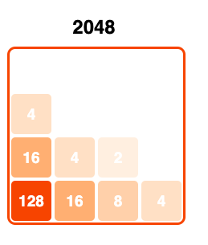

# Simple Calculator

## Initial setup and first build

Compiling the [`purescript`](http://www.purescript.org) code, supposing [`nvm`](http://nvm.sh) is already installed, is as simple as typing:

    > nvm install --lts (12.16.1)
    > npm install -g purescript@0.13.8
    > npm install -g spago@0.16.0
    > npm install -g parcel-bundler@1.12.4
    > npm install -g sass@1.26.11
    > npm install -g yarn@1.22.10
    > yarn clean; yarn build
    > yarn docs
    > yarn develop-app

## VSCode integration

To support editing Purescript files, there are two useful VSCode plugins:
- PureScript IDE: https://github.com/nwolverson/vscode-ide-purescript
- PureScript Language Support: https://github.com/nwolverson/vscode-language-purescript

In order to have errors highlighted directly into VSCode, you need to set one option into the "PureScript IDE" module:
- "purescript.editorMode": true (Editor Mode: Whether to set the editor-mode flag on the IDE server)

To build the application just execute `yarn build`; if you want to cleanup the workarea of all temporary files, `yarn clean` will do it.

To run the application, just type the following two commands in two different terminal windows:
- `yarn develop-purs`   # this is only required if your editor is not integrated with the purs compiler
- `yarn develop-app`    # this command will not build the application; it'll just bundle resources to be loaded by the browser

The first command will invoke `spago` to continuosly compile the PureScript files, while the second will start a web server to serve the application on a local port, reported by [`ParcelJS`]() logs:

    >> starting...
    Server running at http://localhost:1234 
    ✨  Built in 2.36s.

This is what the calculator should look like:
